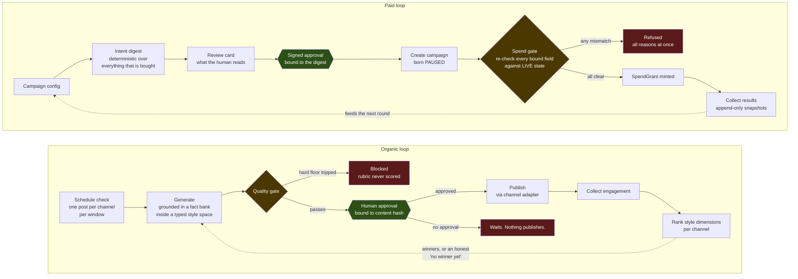

# One-Click Marketing Loop

A distilled, dependency-free reference implementation of a closed marketing loop: **content
generation, quality gating, human approval, distribution, results collection, and learning
that feeds the next round.** Organic accounts and paid campaigns share one spine.

**A human approves before anything publishes or spends, and the approval is
cryptographically bound to the exact content that was reviewed.**

Everything here runs offline. There is no network client in this repository, no credential
is read, nothing publishes, and no money can move.

```bash
git clone https://github.com/joydai2026-del/one-click-marketing
cd one-click-marketing
python3 -m venv .venv && .venv/bin/pip install -e ".[dev]"

.venv/bin/python -m ocm.cli demo      # the whole loop, organic then paid
.venv/bin/python -m ocm.cli organic   # organic rounds only
.venv/bin/python -m ocm.cli paid      # intent, review card, spend gate, collection
.venv/bin/python -m ocm.cli rubric    # print the loaded quality rubric
.venv/bin/python -m pytest            # the test suite
```

Requires Python 3.11 or newer. **Zero runtime dependencies.**

---

## The loop



---

## What is actually interesting here

Most of this is ordinary plumbing. These are the parts that took real thought, each of them
a defense against a specific way an always-on marketing loop goes wrong.

### 1. An approval is bound to content, not to intent

`src/ocm/approval/tokens.py`

"A human approved it" is worth very little if the thing approved can change afterwards. An
operator reviews draft A, clicks approve, the pipeline regenerates into draft B, and the
approval now authorizes something no human ever saw.

So an approval token is an HMAC over a canonical payload that includes the **hash of the
exact bytes shown to the human**. At publish or spend time the caller recomputes the hash of
what it is *about to send*. One changed character and the token is refused.

Six independent checks, each catching a different failure:

| Check | Catches | Raises |
|---|---|---|
| signature | forged or tampered token | `SignatureError` |
| expiry | a stale approval used months later | `ExpiredError` |
| scope | a publish approval reused to authorize spend | `ScopeMismatchError` |
| content | approved A, about to send B | `ContentMismatchError` |
| ceiling | spending more than was approved | `SpendLimitError` |
| nonce | the same approval used twice | `ReplayError` |

Three ordering decisions carry the weight:

- **The signature is checked first**, with `hmac.compare_digest`. Every other field is
  attacker-controlled until the signature says otherwise.
- **The nonce is consumed last**, so a token rejected for being expired or misscoped is not
  silently burned.
- **Domains are separated** with a NUL-terminated prefix, so bytes signed as a publish
  approval cannot be re-presented as a spend approval.

### 2. The spend gate does not stop at a valid signature

`src/ocm/paid/spend_gate.py`

A valid token proves a human approved an *intent*. It does not prove the campaign sitting on
the ad platform right now is still that intent. Between approval and spend, a campaign can be
deleted and recreated under the same id with a different budget.

So every bound field is re-compared against **live platform state** at spend time: subject,
intent digest, budget, currency, and the creatives re-hashed off disk.

- **An empty live digest refuses.** It does not pass. A campaign this system cannot prove
  anything about resolves to no.
- **All mismatches are reported together.** Raising on the first one turns a five-field
  problem into five review cycles.
- **The result is a capability, not a boolean.** `authorize` returns a frozen `SpendGrant`
  that cannot be constructed from outside the module. A boolean can be shadowed by a later
  `= True`.

### 3. The intent digest is deterministic, and excludes anything machine-specific

`src/ocm/paid/intent.py`

A random approval nonce means a retry after a timeout computes a different value, the first
attempt's campaign becomes unfindable, and the retry creates a **second real campaign
spending real money**. A deterministic digest lets the retry *adopt* what the first attempt
may have created. Determinism here is a double-spend control, not a convenience.

Which is why the digest covers everything that changes what is bought (budget, flight,
geo, sorted creative hashes) and deliberately **excludes the config file's directory path**.
Including it would make the same campaign digest differently from two checkouts, recreating
the exact duplicate-campaign bug the determinism exists to prevent. Timestamps are
canonicalized to UTC and truncated to the minute for the same reason.

### 4. Campaigns are born paused, and there is no way to unpause them

`src/ocm/paid/platform.py`

Every created campaign is `PAUSED`, written explicitly at the call site and never defaulted.
There is no `activate()` method and no module-level activation function anywhere in this
repository.

The strongest version of a spend gate is not a better check on the activation path. It is
having no activation path at all, so turning delivery on requires a human in the ad
platform's own console. That is why anyone can clone and run this with no possibility of it
spending money.

The transport refuses non-GET requests written as `method.upper() != "GET"`, not
`== "POST"`, so a later narrowing edit cannot accidentally reopen PUT, PATCH, or DELETE. A
gate should fail toward refusing.

### 5. The learning loop refuses to invent a winner

`src/ocm/learning/ranker.py`

The characteristic failure of an unsupervised optimization loop is that it finds a random
early winner, plays it forever, and its operator reads the resulting flat line as a plateau
rather than as a bug.

So content is generated inside an explicit **style space** (hook x angle x format), every
draft carries its coordinates, and the ranker reports per dimension whether one value
actually beat the others. It declines in three distinct ways, because they call for different
responses:

| Status | Meaning | What to do |
|---|---|---|
| `insufficient_data` | fewer than `min_samples` measurements | keep gathering |
| `low_confidence` | one distinct value, or an exact tie at the top | the space needs more spread |
| `no_separation` | the top mean does not strictly beat the runner-up | these options are equivalent so far |

All three yield `winner=None`, and every consumer refuses to tilt on a `None` winner.

**Absent is not zero.** A published item with no measurement yet is *dropped* from the
sample, never scored `0.0`. Treating "not measured" as "measured badly" teaches the loop to
avoid whatever the collector is currently failing to read.

### 6. Exploration positions are derived, never hand-picked

`src/ocm/generation/style.py`

A loop that always plays the current winner stops learning immediately. So some positions
are reserved for pure exploration, where winners are ignored.

The trap is picking those positions by a round number like "every third tick". If an axis
happens to have 3 values, that resonates with it and explores the **same value every single
time**, so two of its three values are never explored at all. Nobody notices, because the
loop still looks busy.

So the schedule is derived from the axis lengths: the cycle is their lowest common multiple,
and the stride is the smallest step **coprime** with that cycle. Coprimality guarantees the
stride walks the entire cycle before repeating. Add a value to any axis and the schedule
recomputes itself. There is a property test asserting every value of every axis gets covered.

### 7. Per-channel normalization, because raw engagement is not comparable

`src/ocm/channels/adapters.py`

A long-form newsletter reaches a roughly fixed subscriber list, so **absolute engagement** is
the signal. A public short-form feed shows a post to a wildly variable audience, so absolute
engagement mostly measures how the ranking system felt that hour and the signal is the
**rate**.

Ranking those on one leaderboard by raw counts lets a single viral short post drown out every
newsletter forever, and the loop learns the wrong lesson. So `normalize` lives on the
*adapter*, each channel converts its own counters to a 0-1 score, and the ranker never sees a
raw counter.

The short-form adapter also returns `0.0` below an impression floor. Three engagements on
eleven impressions is a 27 percent rate and means nothing.

### 8. The quality gate short-circuits, in a deliberate order

`src/ocm/evaluation/gate.py`

1. **compliance floors** (cheap, deterministic, non-compensable)
2. **dedup** (cheap, deterministic, non-compensable)
3. **rubric scoring** (an LLM call in production, compensable)

Steps 1 and 2 short-circuit. There is no point paying a judge to grade a draft that is
already disqualified, and no threshold high enough to make a compliance failure acceptable.
A test proves the scorer is never called when a floor trips.

The rubric is ten weighted dimensions loaded from `config/example/rubric.toml`. Two of them
carry a **floor**: a weighted average correctly lets good writing offset a dull opener, but
it must not let good writing offset an invented statistic or a missing disclosure.

The compliance floor includes a **configurable forbidden-substring check**, matched after
NFKC folding, invisible-character stripping, and whitespace collapse, so cosmetic evasion
does not work. Violations are reported **by index rather than by value**, because the term
list is the sensitive artifact and an audit log is a wider surface than a config file. The
same terms are masked out of the "avoid repeating these" block before recent history is shown
back to the generator, so the model is never handed the exact string it was told never to
write.

### 9. Near-duplicate rejection, which a hash cannot do

`src/ocm/evaluation/dedup.py`

An always-on generator drifts toward its own greatest hits and re-posts a paraphrase of last
week's best performer. Exact-hash dedup does not catch this: one changed word is a new hash.
So there are two guards, because they fail differently: exact hash (catches a retry or a
double dispatch) and shingle-based Jaccard similarity against the published corpus (catches
the generator paraphrasing itself).

### 10. Identity comes from the slot, never from the generated text

`src/ocm/generation/identity.py`

Generation is non-deterministic. If a work item's identity is derived from its output, a
crash-and-retry produces a new id, the store does not recognize it, and the pipeline
publishes a second copy of something a human already saw.

So `slot_id = sha256(style_id | topic)` and identity is derived from the **slot inputs**. Re-run
the same tick and every id is identical, so the store's uniqueness check deduplicates for
free. Fields are NUL-separated so `("a.b", "c")` and `("a", "b.c")` cannot collide, and a slot
collision within one run raises loudly rather than letting planned content silently vanish.

### 11. `posting` exists so a crash is not ambiguous

`src/ocm/publishing.py`

The publish state machine is an explicit transition table, and `evaluated -> published` is
not in it: nothing reaches a channel without passing through an approval.

`posting` is the phase committed immediately **before** the network call. Without it, a crash
mid-publish is indistinguishable from a crash before publish, and recovery has to guess.
Guessing wrong loses a post in one direction and double-posts in the other.

An **indeterminate outcome is not a failure**. A timeout parks the row and is never
auto-retried, because retrying an unknown outcome is how one approved campaign becomes two.
And a channel reporting success with no external id raises: that is a post the system can
never find, measure, or delete, which is worse than a failure.

### 12. Results storage is append-only, resolved at read time

`src/ocm/paid/collector.py`

Ad platforms **restate history**: a number for last Tuesday can change on Thursday. Upserting
destroys the record of what you knew when you made the decision. So every collection appends
a snapshot, and the current value is resolved by a latest-effective query keyed on
(ad, day, attribution window), newest source timestamp winning. A late-arriving *older*
restatement does not win.

Four more rules, each from a real failure mode:

- **Missing is `None`, never `0.0`.** A metric the platform did not report is not a
  measurement of zero. A genuine reported zero is kept as zero: those must stay
  distinguishable. `total_spend_minor()` returns `None` when nothing is readable, because a
  budget guard reading "0 spent" from "cannot see the spend" lets a campaign run forever.
- **Actions are found by name, never by position.** Indexing into the action list works right
  up until the order changes, at which point purchases are read from the wrong bucket with no
  error.
- **Spend is converted from major to minor units, never copied.** A copied figure is a
  hundredfold understatement that the budget guard would wave through.
- **The attribution window is pinned and stored on every row.** Inheriting the account default
  means a setting changed in a web UI silently redefines what every stored row *means*.

### 13. Money is integers, and the decision metric is pre-registered

`src/ocm/paid/campaign.py`

Budgets are integers in minor units. Float arithmetic on money produces a ceiling that is
occasionally a hundredth over, and "occasionally over the approved amount" is the one thing a
spend guard may not be.

Budgets are **lifetime, not daily**, because platforms treat a daily budget as a target they
may overshoot. A daily figure is not a cap and must not be presented as one.

`decision_metric` is required and non-empty: the number the round will be judged on is named
*before* any money moves. Choosing it afterwards from the results is how every campaign
becomes a success, because there is always some metric that went up.

Config keys are a **closed allowlist** and an unknown key raises. A typo'd key that is
silently ignored gives you a campaign running with a default nobody chose.

---

## Human in the loop

Two gate modes, both config-driven. The difference is precise:

| Mode | Behavior |
|---|---|
| `human` (shipped default) | the run stops. A signed approval must be supplied out of band. |
| `auto` | may proceed without the human tap, but **only** for a draft that passed every check with zero flags. |

**Auto skips the tap, never the check.** A draft that fails in auto mode is left *pending* for
a human and is never auto-rejected: the machine is trusted to say "this is clean", not to say
"this is bad".

Both graduation latches ship **off**. `auto` requires `gate_mode = "auto"` *and* a separate
`auto_approval_enabled` flag, so a single edit cannot silently make the loop unattended. A
test asserts the shipped default publishes nothing.

---

## Module layout

```
src/ocm/
├── models.py            core records; everything crossing a stage carries a content hash
├── config.py            TOML/JSON loading; credentials may only be ${ENV_REF}, never literals
├── loop.py              the orchestrator: one full round, and the ordering rationale
├── publishing.py        publish state machine, at-most-once publishing, schedule policy
├── generation/
│   ├── style.py         the style space, deterministic rotation, coprime exploration schedule
│   ├── identity.py      slot-derived ids so a retry is idempotent
│   └── generator.py     grounded drafting, retry budget, forbidden-term masking
├── evaluation/
│   ├── rubric.py        weighted dimensions, per-dimension floors, pluggable scorer
│   ├── compliance.py    hard floors: forbidden substrings, link/length/marker rules
│   ├── dedup.py         exact-hash plus shingle similarity
│   └── gate.py          composes the three, in short-circuit order
├── channels/
│   ├── base.py          the four-verb adapter interface, and the transport seam
│   ├── transport.py     DryRunTransport (default) and an unimplemented LiveTransport
│   ├── adapters.py      long-form and short-form examples, each normalizing its own way
│   └── registry.py      config-driven construction; unknown kind is a hard error
├── approval/
│   ├── errors.py        one exception base, so one `except` catches every refusal
│   ├── tokens.py        content-bound HMAC approvals, domain-separated
│   └── ledger.py        single-use enforcement; SQLite INSERT is the test-and-set
├── learning/
│   └── ranker.py        per-dimension ranking, three honest no-winner states, Tilt
└── paid/
    ├── campaign.py      config schema, guardrails, pre-registered stop clock
    ├── intent.py        the deterministic intent digest and the review card
    ├── creative.py      path resolution that cannot depend on the working directory
    ├── platform.py      the transport seam; born-paused; no activation path
    ├── spend_gate.py    signature plus live-state re-check; mints a SpendGrant
    └── collector.py     append-only snapshots, read-time restatement resolution
```

---

## Distilled versus illustrative

This matters more than the code, so it is stated plainly.

This repository is a **clean-room reimplementation** of the mechanisms behind a private
production system that publishes on a schedule and runs paid campaigns. It shares no code,
no configuration, no content, and no account with that system. It was written from an
architectural description, not copied.

### Distilled from a system that runs in production

These mechanisms, and the reasoning behind each, come from a working system. The bugs the
comments describe are bugs that actually happened.

- The content-bound approval token, and the ordering of its checks.
- The spend gate's re-check of every bound field against live platform state, and reporting
  all mismatches at once.
- The deterministic intent digest as a double-spend control, and its exclusion of
  machine-specific paths.
- Born-paused campaigns with no activation path in code.
- Append-only metric snapshots with read-time restatement resolution, and `None` never
  becoming `0`.
- Creative path resolution that cannot depend on the process working directory, and
  re-hashing every creative before the first write.
- The quality gate's short-circuit ordering, and non-compensable floors.
- Two-layer dedup, and slot-derived identity for retry idempotency.
- Per-channel normalization, and the impression floor.
- The three no-winner states, and dropping unmeasured samples.
- The coprime exploration schedule.
- `posting` as a committed pre-network phase, and indeterminate-is-not-failed.
- The two-latch human gate, and auto skipping the tap but never the check.

### Illustrative scaffolding, written for this repository

- **The rubric's ten dimensions** are generic marketing-content dimensions written for this
  repo. The production rubric is private. The *structure* (weights, floors, threshold,
  config-loaded) is the distilled part.
- **The forbidden-terms list** is two obvious placeholders. The real list is the sensitive
  artifact in its config. The *mechanism* is the distilled part.
- **All content is fabricated.** The fact bank, topics, and sample creatives describe an
  invented product and assert nothing about any real company, person, or result.
- **The two channel adapters** are examples chosen to have genuinely different economics.
  They implement the real interface but talk to no real API.

### What is stubbed, and what that means

| Piece | Status |
|---|---|
| Transports (organic and paid) | **Stubbed.** `DryRunTransport` and `DryRunPlatform` record calls and return synthetic responses. `LiveTransport.send` raises `NotImplementedError`. |
| The rubric scorer | **Stubbed.** In production a language model reads each dimension's description and grades the text. `stub_scorer` returns a fixed passing value. |
| The content generator | **Stubbed.** `TemplateGenerator` is a deterministic offline template. Every string it writes says so in its own text. |
| Persistence | **In-memory by default.** `SqliteLedger` is real and durable; the snapshot store and post log are in-memory unless given a path. |

Two notes on honesty, since a stub is exactly where a demo can mislead:

The rubric scorer returns a **constant**, deliberately not a pseudo-random score. A
pseudo-random score looks like a judgment and is not one: it would trip real compliance
floors at random and print "factual grounding below floor" about text nothing ever assessed.
A constant says plainly that no quality judgment was made. Everything *around* the score is
real and tested: the weighting, the floors, the threshold, and the short-circuit ordering.

The dry-run is **not a mode that could be flipped**. There is no `--live` flag and no
credential path. `tests/test_dryrun_truth.py` asserts mechanically that no module in `src/`
imports `requests`, `httpx`, `urllib.request`, `socket`, or `http.client`.

### Not claimed

Engagement rank is **not causal lift**. Nothing here runs a holdout, so nothing here can
attribute a result to a creative. The guidance strings say "scored higher", never "performed
better because". Measuring real incrementality is a different and much more expensive
instrument than this loop has.

---

## Configuration

Every value an operator might reasonably want to change lives in `config/example/`: the
rubric and its thresholds, the compliance rules, the style space, the channel list and each
channel's limits, the learning parameters, the schedule policy, and every paid guardrail.
None has a meaningful hardcoded default in the engine.

**Credentials never live in config.** A config field may only reference an environment
variable as `${UPPER_SNAKE}`. A literal value is *refused*, not warned about, because a
warning gets scrolled past and a secret in a config file gets committed. This repository
ships no key and no `.env`.

---

## Tests

The suite covers the mechanisms above rather than line count: the gate's short-circuit and
its non-compensable floors, both dedup layers, every approval refusal path plus the ordering
guarantee that a rejected token is not burned, domain separation, the spend gate's live
re-check and its all-reasons-at-once refusal, digest determinism and machine independence,
working-directory-independent creative resolution, restatement resolution and
missing-is-not-zero, the transition table, the three no-winner states, absent-is-not-zero,
the property test for exploration coverage, and the honesty tests that mechanically prove the
dry-run claims.

```bash
.venv/bin/python -m pytest -v
```

---

## License

MIT. See [LICENSE](LICENSE).
